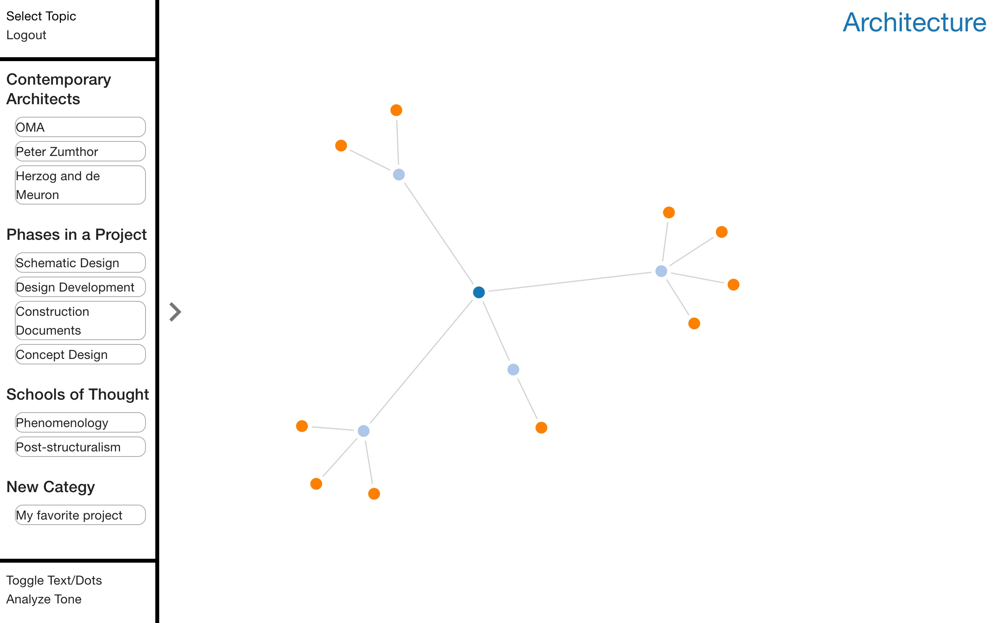

# Idea Shuffle - Solo Project

Web application link: https://tranquil-waters-36326.herokuapp.com/#/home

Idea Shuffle is a full-stack web application developed to upgrade the efficiency and convenience of brainstorming sessions.  Brainstorming sessions are displayed as idea webs to clarify the evolving organization of ideas for users.  To add ideas, users either interact with an Amazon Echo custom skill or click on nodes in the idea web.  Follow the instructions below to get this application up and running.

## Built With

D3.js, Alexa custom skills creation, AngularJS, AngularJS Material, ng-sortable, Node.JS, MongoDB, Express.js, HTML5, CSS3, and Javascript.

## Getting Started

-Clone the repository and copy it onto your machine
-Make sure mongo is running in an open tab
-Run 'npm install' and 'npm start' in terminal
-Open a browser window to 'localhost:5000'

### Prerequisites

- [Node.js](https://nodejs.org/en/)
- An Amazon Web Service (AWS) server will be required for the Alexa portion of the app.
- An Amazon Developer account will be required to create the skill with intents and slots.

## Screen Shots

Select a Topic Page

Dot Brainstorming Web

Test Brainstorming Web

## Documentation

The scope document that was used to guide the development of this web application can be found here: https://docs.google.com/document/d/1gFspUJHuTq6Q1Px7u029CLwlKXO_vt_5K79j6dG_xvk/edit?usp=sharing

### Completed Features

High level list of items completed.

- [x] Feature a
- [x] Feature b

### Next Steps

Features that you would like to add at some point in the future.

- [ ] Feature c

## Deployment

Add additional notes about how to deploy this on a live system

## Authors

* Name of author(s)

## Acknowledgments

* Hat tip to anyone who's code was used
